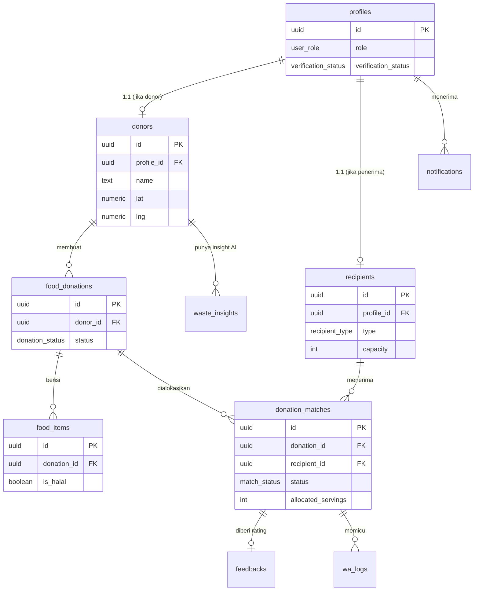

# Schema Database — BagiRasa

Database: **Supabase (PostgreSQL)**. Semua tabel memakai **Row Level Security (RLS)**.

Konvensi:
- Nama tabel: `snake_case`, jamak.
- Primary key: `id uuid default gen_random_uuid()`.
- Timestamp: `created_at`, `updated_at` (timestamptz, default `now()`).
- Semua relasi antar aktor mengacu ke `profiles.id`.

---

## 1. ERD



---

## 2. Enums

```sql
create type user_role as enum ('donor', 'recipient', 'admin');
create type recipient_type as enum ('panti_asuhan', 'rumah_lansia');
create type verification_status as enum ('pending', 'verified', 'rejected');
create type donation_status as enum ('draft', 'available', 'matched', 'completed', 'cancelled');
create type match_status as enum ('pending', 'accepted', 'rejected', 'confirmed', 'completed');
create type food_type as enum ('makanan_berat', 'makanan_ringan', 'minuman', 'roti_kue', 'buah_sayur', 'lainnya');
```

---

## 3. Tabel

### 3.1 `profiles`
Ekstensi dari `auth.users` bawaan Supabase. Menyimpan peran & status verifikasi.

```sql
create table profiles (
    id uuid primary key references auth.users(id) on delete cascade,
    role user_role not null,
    verification_status verification_status not null default 'pending',
    email text not null,
    phone text,
    created_at timestamptz not null default now(),
    updated_at timestamptz not null default now()
);
```

### 3.2 `donors`
Detail restoran/warteg. Relasi 1:1 dengan profile berperan `donor`.

```sql
create table donors (
    id uuid primary key default gen_random_uuid(),
    profile_id uuid not null unique references profiles(id) on delete cascade,
    name text not null,
    address text not null,
    lat numeric(9,6) not null,
    lng numeric(9,6) not null,
    phone text not null,
    photo_url text,
    ktp_url text not null,
    reputation_score numeric(3,2) not null default 0,
    created_at timestamptz not null default now(),
    updated_at timestamptz not null default now()
);
```

### 3.3 `recipients`
Detail penerima. Satu tabel untuk panti asuhan & rumah lansia, dibedakan kolom `type`.

```sql
create table recipients (
    id uuid primary key default gen_random_uuid(),
    profile_id uuid not null unique references profiles(id) on delete cascade,
    type recipient_type not null,
    name text not null,
    address text not null,
    lat numeric(9,6) not null,
    lng numeric(9,6) not null,
    phone text not null,
    capacity int not null,
    current_need int not null default 0,
    allergen_restrictions text[] not null default '{}',
    halal_only boolean not null default true,
    photo_url text,
    legal_doc_url text not null,
    last_received_at timestamptz,
    created_at timestamptz not null default now(),
    updated_at timestamptz not null default now()
);
```

- `capacity` — jumlah penghuni.
- `current_need` — kebutuhan porsi saat ini (dipakai matching & batch).
- `allergen_restrictions` — daftar alergen yang harus dihindari.
- `last_received_at` — untuk skor keadilan (fairness).

### 3.4 `food_donations`
Satu donasi = satu event penyaluran, bisa berisi banyak item.

```sql
create table food_donations (
    id uuid primary key default gen_random_uuid(),
    donor_id uuid not null references donors(id) on delete cascade,
    status donation_status not null default 'draft',
    selection_mode text not null default 'auto',
    notes text,
    created_at timestamptz not null default now(),
    updated_at timestamptz not null default now()
);
```

- `selection_mode` — `auto` (rekomendasi web) atau `manual` (donor pilih sendiri). Fitur 7.

### 3.5 `food_items`
Item makanan dalam satu donasi.

```sql
create table food_items (
    id uuid primary key default gen_random_uuid(),
    donation_id uuid not null references food_donations(id) on delete cascade,
    name text not null,
    photo_url text,
    food_type food_type not null,
    shelf_life_hours int not null,
    is_halal boolean not null default true,
    ingredients text not null,
    allergens text[] not null default '{}',
    quantity int not null,
    unit text not null default 'porsi',
    servings int not null,
    created_at timestamptz not null default now()
);
```

- `shelf_life_hours` — ketahanan makanan dalam jam.
- `ingredients` — teks bahan (sumber ekstraksi alergen AI).
- `allergens` — hasil ekstraksi (dapat dikoreksi manual).
- `servings` — estimasi porsi (dipakai total porsi matching).

### 3.6 `donation_matches`
Alokasi satu donasi ke satu penerima. Satu donasi bisa punya banyak match (batch mode auto, atau multi-panti mode manual).

```sql
create table donation_matches (
    id uuid primary key default gen_random_uuid(),
    donation_id uuid not null references food_donations(id) on delete cascade,
    recipient_id uuid not null references recipients(id) on delete cascade,
    status match_status not null default 'pending',
    allocated_servings int not null,
    distance_km numeric(6,2) not null,
    match_score numeric(5,4),
    notified_at timestamptz,
    responded_at timestamptz,
    handed_over_at timestamptz,
    created_at timestamptz not null default now(),
    updated_at timestamptz not null default now()
);
```

- `allocated_servings` — porsi yang dialokasikan ke penerima ini. Panti terakhir pada mode manual bisa menerima alokasi **parsial**.
- **Invariant**: `Σ allocated_servings` untuk satu `donation_id` **≤** total porsi donasi. Divalidasi di server (`lib/`) sebelum menulis match — bukan di DB.
- `match_score` diisi pada mode auto; boleh `null` pada mode manual (penerima dipilih donor).

### 3.7 `feedbacks`
Rating dari penerima ke restoran setelah penyerahan. Fitur 3.

```sql
create table feedbacks (
    id uuid primary key default gen_random_uuid(),
    match_id uuid not null unique references donation_matches(id) on delete cascade,
    recipient_id uuid not null references recipients(id) on delete cascade,
    donor_id uuid not null references donors(id) on delete cascade,
    rating int not null check (rating between 1 and 5),
    comment text,
    created_at timestamptz not null default now()
);
```

### 3.8 `notifications`
Notifikasi in-app per pengguna.

```sql
create table notifications (
    id uuid primary key default gen_random_uuid(),
    profile_id uuid not null references profiles(id) on delete cascade,
    title text not null,
    body text not null,
    type text not null,
    reference_id uuid,
    is_read boolean not null default false,
    created_at timestamptz not null default now()
);
```

### 3.9 `wa_logs`
Log pengiriman WhatsApp via Fonnte (audit & anti-abuse).

```sql
create table wa_logs (
    id uuid primary key default gen_random_uuid(),
    match_id uuid references donation_matches(id) on delete set null,
    target_phone text not null,
    message text not null,
    status text not null,
    provider_response jsonb,
    created_at timestamptz not null default now()
);
```

### 3.10 `waste_insights`
Cache hasil insight AI (Gemini) per donor. Fitur 4.

```sql
create table waste_insights (
    id uuid primary key default gen_random_uuid(),
    donor_id uuid not null references donors(id) on delete cascade,
    period_start date not null,
    period_end date not null,
    summary text not null,
    impact jsonb not null,
    recommendations jsonb not null,
    generated_at timestamptz not null default now()
);
```

- `impact` — mis. `{"meals_rescued": 120, "est_kg": 45.5, "est_co2_kg": 110}`.
- `recommendations` — array saran actionable.

---

## 4. Index

```sql
create index idx_donors_location on donors (lat, lng);
create index idx_recipients_location on recipients (lat, lng);
create index idx_recipients_type on recipients (type);
create index idx_donations_donor on food_donations (donor_id);
create index idx_donations_status on food_donations (status);
create index idx_items_donation on food_items (donation_id);
create index idx_matches_donation on donation_matches (donation_id);
create index idx_matches_recipient on donation_matches (recipient_id);
create index idx_matches_status on donation_matches (status);
create index idx_notifications_profile on notifications (profile_id, is_read);
```

---

## 5. Trigger

### `updated_at` otomatis
```sql
create or replace function set_updated_at()
returns trigger language plpgsql as $$
begin
    new.updated_at = now();
    return new;
end;
$$;

create trigger trg_profiles_updated before update on profiles
    for each row execute function set_updated_at();
```
Terapkan trigger serupa pada semua tabel yang punya `updated_at`.

### Buat profile otomatis saat signup
```sql
create or replace function handle_new_user()
returns trigger language plpgsql security definer as $$
begin
    insert into profiles (id, email, role)
    values (new.id, new.email, (new.raw_user_meta_data->>'role')::user_role);
    return new;
end;
$$;

create trigger trg_on_auth_user_created after insert on auth.users
    for each row execute function handle_new_user();
```

---

## 6. Ringkasan Kebijakan RLS

> **RLS tidak menggantikan `grant`.** Keduanya lapisan terpisah dan keduanya wajib:
> `grant` menentukan apakah sebuah peran **boleh menyentuh tabelnya sama sekali**, RLS menentukan **baris mana** yang terlihat. Kalau `grant` tidak ada, Postgres menolak lebih dulu dengan `42501: permission denied for table ...` dan policy RLS tidak pernah sempat dievaluasi — sehingga policy yang benar pun terlihat seperti gagal.
>
> Tabel yang dibuat lewat SQL Editor **tidak otomatis** mendapat izin untuk peran `authenticated`. Setiap migration yang membuat tabel baru harus disertai `grant` eksplisit, misalnya:
>
> ```sql
> grant select, insert on public.nama_tabel to authenticated;
> ```
>
> Gunakan `grant` selektif per kolom untuk kolom yang hanya boleh diubah server:
>
> ```sql
> revoke update on public.profiles from authenticated;
> grant update (email, phone) on public.profiles to authenticated;
> ```
>
> Tanpa pembatasan kolom ini, pengguna bisa mengubah `role` atau `verification_status` miliknya sendiri — RLS saja tidak bisa mencegahnya, karena RLS bekerja di level baris, bukan kolom.

Aktifkan RLS di semua tabel, lalu terapkan prinsip:

| Tabel | Kebijakan |
|---|---|
| `profiles` | Pengguna hanya baca/ubah profilnya sendiri; admin baca semua. |
| `donors` | Donor kelola datanya sendiri; recipient/admin hanya baca (untuk matching/verifikasi). |
| `recipients` | Recipient kelola datanya sendiri; donor baca data kandidat matching; admin baca semua. |
| `food_donations` / `food_items` | Donor kelola donasinya sendiri; recipient baca donasi yang dialokasikan kepadanya. |
| `donation_matches` | Donor & recipient terkait boleh baca/ubah statusnya; admin baca semua. |
| `feedbacks` | Recipient membuat; donor baca miliknya; admin baca semua. |
| `notifications` | Pengguna hanya baca notifikasinya sendiri. |
| `wa_logs` / `waste_insights` | Hanya server (service role) yang menulis; donor baca insight miliknya. |

Contoh policy:
```sql
alter table donors enable row level security;

create policy "donor kelola data sendiri" on donors
    for all using (auth.uid() = profile_id) with check (auth.uid() = profile_id);

create policy "admin baca semua donor" on donors
    for select using (
        exists (select 1 from profiles p where p.id = auth.uid() and p.role = 'admin')
    );
```

---

## 7. Storage

Bucket **`identity-documents`** (privat) menyimpan file yang dirujuk kolom `donors.ktp_url` dan `recipients.legal_doc_url`. Kolom di database hanya menyimpan alamat; filenya hidup di bucket.

**Konvensi path wajib:** setiap file disimpan dengan ID pengguna sebagai folder terdepan.

```
identity-documents/<auth.uid()>/ktp.jpg
identity-documents/<auth.uid()>/legal-doc.pdf
```

Policy storage mencocokkan folder terdepan dengan ID pengguna yang sedang login:

```sql
(storage.foldername(name))[1] = (select auth.uid())::text
```

File yang ditaruh di akar bucket tanpa folder ID **akan ditolak** dengan error izin. Pemilik dokumen boleh unggah, baca, ganti, dan hapus di foldernya sendiri; admin boleh membaca semua untuk keperluan verifikasi.

Bucket dibatasi 5 MB per file dan hanya menerima `image/jpeg`, `image/png`, `image/webp`, `application/pdf`.

---

## 8. Catatan Implementasi

- Generate tipe TypeScript dari schema: `supabase gen types typescript` → dipakai di seluruh kode.
- Operasi sensitif (kirim WA, panggil Gemini, tulis `wa_logs`/`waste_insights`) dijalankan server-side dengan service role, bukan dari client.
- Perhitungan jarak (haversine) dan logika batch hidup di `lib/matching.ts` (fungsi murni), dipanggil dari Route Handler tipis — bukan di database maupun client.
- **Invariant alokasi** — sebelum menulis baris `donation_matches`, server memastikan total `allocated_servings` untuk satu donasi tidak melebihi total porsi donasi. Di mode manual, tombol tambah panti dikunci saat sisa porsi habis; panti terakhir boleh menerima alokasi parsial.
